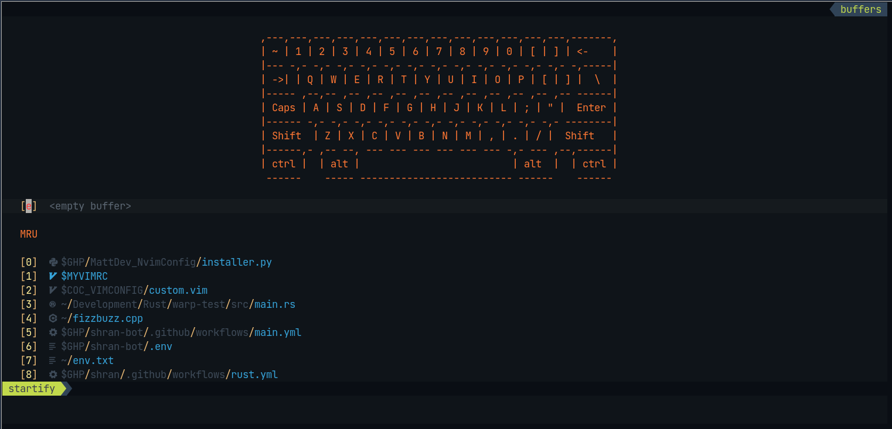
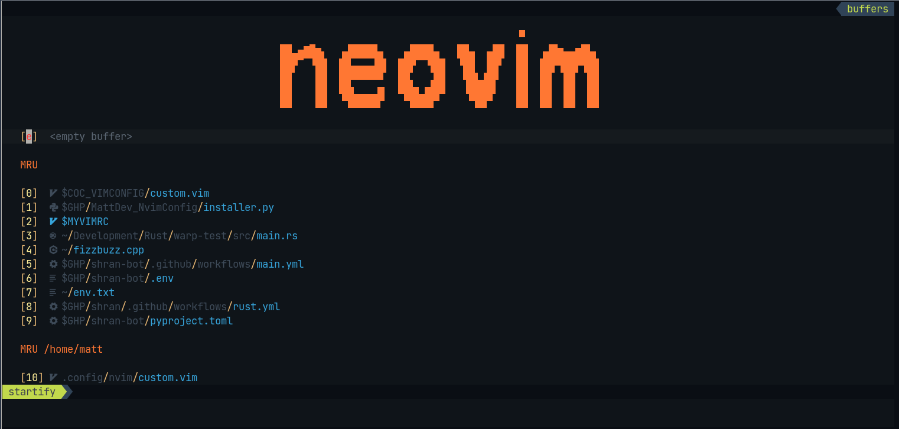
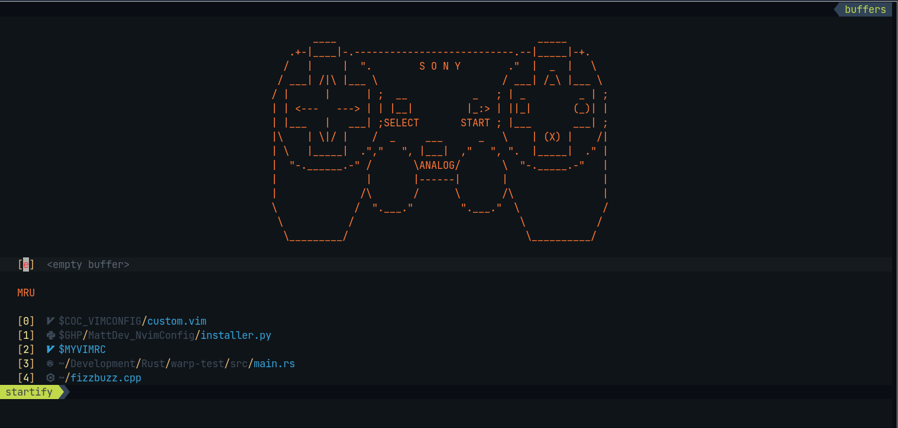

<div align="center">
  <h1>One Neovim config to rule them all</h1>
  
  <br>
</div>

<div align="center">
     
    
    
    
  <h5>
    Note: My configurations are heavily inspired by Fisa Dev's nvim configs,
    over a year and a half, my config has came into its own. Much thanks to Fisa
    and all the contributors to his repo
  </h5>

</div>


## :rocket: Features

* :white_check_mark: latex support
* :white_check_mark: polyglot language support
* :white_check_mark: better C/C++ highlighting and language support
* :white_check_mark: Uses Conquer of Completion for a language server (VScode backend)
* :white_check_mark: floating terminal support
* :white_check_mark: internal browser search engine
* :white_check_mark: file browsing through Nerdtree, and ranger
* :white_check_mark: uses airline
* :white_check_mark: uses fancy symbols (You need to install a Nerdfont and enable in your terminal)
* :white_check_mark: fzf (fuzzy finder search)
* :white_check_mark: So many other features, Read the Docs for more information

## :neckbeard: Nerdy Screen Shots

<div align="center">
  <h2>Startify Ascii Art</h2>
  
  
  
</div>

## :traffic_light: Dependencies

### :loudspeaker:  Node is required, using NVM is the preferred method

* **Node version manager is a better way** [Install instructions and Docs](https://github.com/nvm-sh/nvm)

### :loudspeaker:  If you are using Fish, get the following

* **fisher** package manager [Install instructions and Docs](https://github.com/jorgebucaran/fisher)

* **nvm for fisher** fish wrapper for nvm [Install instructions and Docs](https://github.com/jorgebucaran/nvm.fish)

## :building_construction: Installation

### :hammer: Optional

* **Full Fledged terminal file browser** [Install instructions and Docs](https://github.com/ranger/ranger)

## :keyboard: Install script (installer.py)

```bash
usage: installer [options]

Install neovim config on supported platforms and include optional parameters

optional arguments:
  -h, --help       show this help message and exit
  -i, --install
  -u, --uninstall
  --rustup         Install the rustup toolchain, and install sefr command line search engine program for neovim
  --nvm            Install node version manager

I hope you enjoy my config, please submit a pull request or open an issue for improvements
```

### :information_source: More information on Conquer of Completetion extensions

* **Coc extensions** [coc](https://github.com/neoclide/coc.nvim/wiki/Using-coc-extensions)

## :godmode: Screenshots and Gifs

## :scroll: Documentation ( To be completed later )
